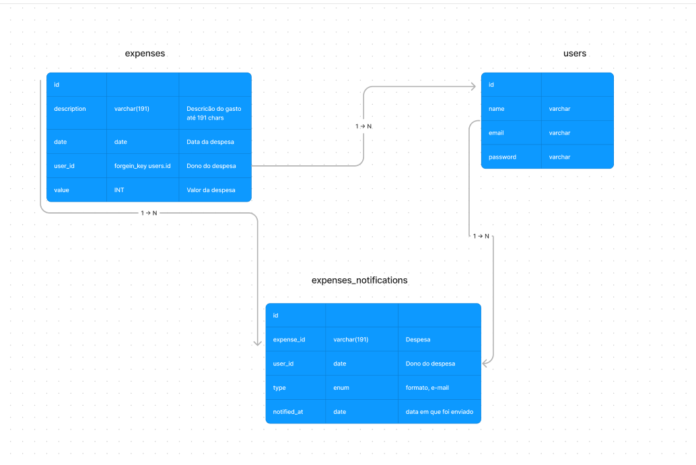

### Documentacão da API

- [Postman](https://www.postman.com/research-geologist-98703909/workspace/apis/collection/34267895-8a809235-0ce2-460f-a53b-e16e53935b51?action=share&creator=34267895)
- Diagrama do banco:
  

## Requisitos

- PHP 8.2
- Composer 2.*
- Docker e Docker Compose
- Laravel Sail

## Pacotes

- Laravel - Docker com os servicos
- Sanctum - API Auth
- PHPUnit - Testes
- Laravel Pint - Formato de código
- Larastan - Analise estática

## Docker

- Mysql -> Banco de dados SQL
- Redis -> Fila
- Mailpit -> Envio de e-mails

## Executando o App

- Clone o projeto
- Copie o .env.example para .env
- Instale os pacotes:

```
    composer install && npm install
```

- Execute o Docker:

```
    sail up
```

O app será executado em: [http://localhost:80](http://localhost:80)

- Execute as migrations e seeders:

```
    sail artisan migrate:fresh --seed
```

- Um usuário de teste será criado com o seguinte acesso

```
    'email' => 'dev@test.com',
    'password' => '123123123'
```

## Testes

Executa o laravel `Pint`, `Larastan` e `PHPUnit`

```shell
composer test
```

### Processo de desenvolvimento API

- [x] Desenhar o diagrama do banco
- [x] Configurar o projeto
    - [x] Docker sail
    - [ ] Pest PHP (Só está disponivel para versão 8.1)
    - [x] PHPUnit
    - [x] Laravel Pint
    - [x] Larastan
- [x] Documentar endpoints no postman
- [x] Autenticacão e Testes
- [x] Despesas e Testes
- [x] Permissões
- [x] Notificacões


